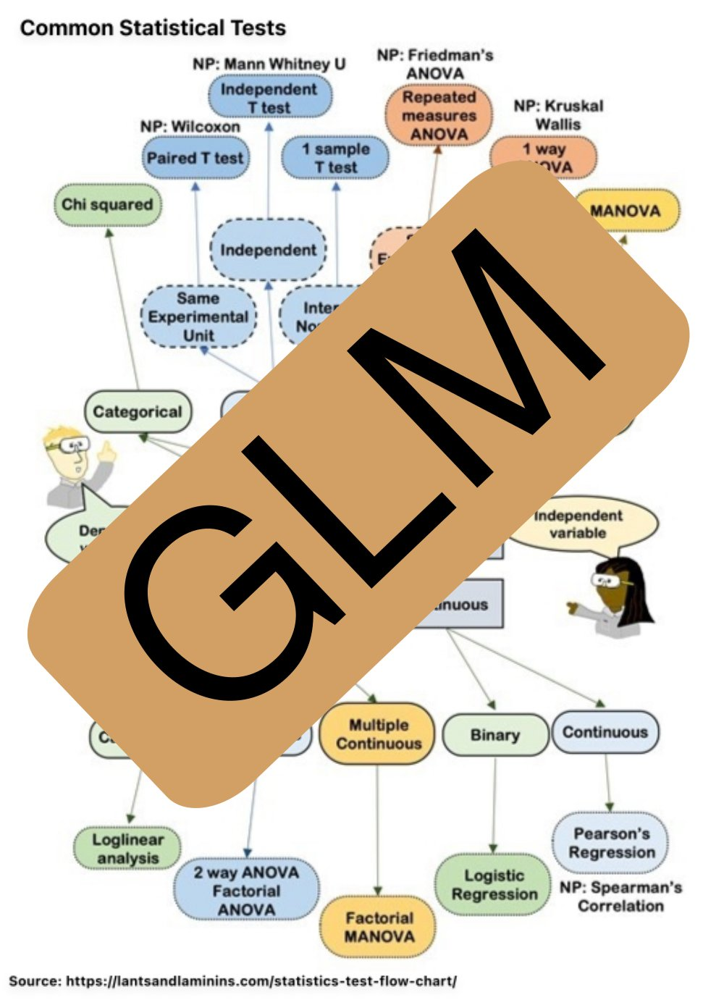

```{r setup, include=FALSE}
knitr::opts_chunk$set(echo = TRUE)
```

# Interactive lectures - problem set

You may of cause read through the problem set before the interactive lecture, but that is not a prerequisite. Solutions will be provided to the major part of the recommended exercises (but not to the R-part of this one).

**Hints and reminders are in bold**
 
<span class="question">Questions appear in blue.</span>

<details><summary>Some hints and answers are hidden away in a fold like this</summary>
Well done, you found me!
</details>

The exam style questions are optional, but will be helpful for, well, the exam. They will also help you now to see if you understand the content.

# Core concept: Exponential family of distributions 

{width=50%}

(source: [Barry Rowlingson on Twitter. Sorry, X](https://x.com/geospacedman/status/1825255764719726607))

In this course we will look at models where the distribution of the response variable, $y_i$, can be written in the form of a _univariate exponential family_
\[ f(y_i\mid \theta_i)=\exp \left( \frac{y_i \theta_i-b(\theta_i)}{\phi}\cdot w_i + c(y_i, \phi, w_i) \right) \]
where

* $\theta_i$ is called the canonical parameter and is a parameter of interest

* $\phi$ is called a nuisance parameter (and is not of interest to us=therefore a nuisance (plage))

* $w_i$ is a weight function, in most cases $w_i=1$

* b and c are known functions.

It can be shown that $\text{E}(Y_i)=b'(\theta_i)$ and $\text{Var}(Y_i)=b''(\theta_i)\cdot \frac{\phi}{w}$.

Remark: slightly different versions of writing the exponential family exists, but we will use this version in our course (a different version might be used in TMA4295, but the basic findings are the same).

## Theoretical questions (first hour)

We will work with the exponential family, but to make the notation easier for these tasks, we omit the $i$ subscript.

\[ f(y \mid \theta)=\exp \left( \frac{y \theta-b(\theta)}{\phi}\cdot w + c(y, \phi, w) \right) \]

### Problem 1: 

Choose (discuss and then talk to lecturer/TA) if you will work on a) binomial, b) Poisson, c) univariate normal or d) gamma. For your choice:

- <span class="question">What process can produce a $Y$ that follows this distribution?</span>
- <span class="question">Write down the probability mass function, f(x). </span>
- <span class="question">Is the distribution a member of the exponential family?</span> 
- <span class="question">Identify $b$ and $c$ and show the connection with the mean and variance of $Y$.</span>

<details><summary>Hints for binomial distribution</summary>

You may first use $n=1$ in the binomial (which then is called Bernoulli) - since that is much easier than a general $n$.

Hint: <https://wiki.math.ntnu.no/tma4245/tema/begreper/discrete> and nearly the same parameterization for showing the binomial is member of exponential <https://www.youtube.com/watch?v=7mNrsFr7P_A>.

Also: $x = e^{\ln x}$

</details>

<details><summary>Hints for Poisson distribution</summary>
Hint: <https://wiki.math.ntnu.no/tma4245/tema/begreper/discrete> and first part of [Sannsynlighetsmaksimering](https://mediasite.ntnu.no/Mediasite/Play/db9c6fbc45bf48abb8a4dd00ff146e081d?catalog=0fce6173-7a98-4db7-84b7-50cba3a3a341)
</details>

<!-- ## The Poission process -->
<!-- We observe events that may occur within a time interval or a region.  -->

<!-- 1. The number of events occuring within a time interval or a region, is independent of the number of events that occurs in any other disjoint (non-overlapping) time interval or region. -->
<!-- 2. The probability that a single event occurs within a small time interval or region, is proportional to the length of the interval or the size of the region. -->
<!-- 3. The probability that more than one event may occur within a small time interval or region is negligable. -->

<!-- When all of these three properties are funfilled we have a _Poisson process_. This leads to three distributions -->

<!-- * The number of events in a Poisson process follows a Poisson distribution. -->
<!-- * Time between two events in a Poisson process follows an exponential distribution. -->
<!-- * Time between many events in a Poisson process follows a gamma distribution. -->


<details><summary>Hints for Gamma distribution</summary>

There are a few parameterisations for the Gamma. Try this one:

$$ f(y)=\frac{1}{\Gamma(\nu)} (\frac{\nu}{\mu})^{\nu} y^{\nu-1}\exp(-\frac{\nu}{\mu}y) \text{ for }y>0$$

Hint: <https://wiki.math.ntnu.no/tma4245/tema/begreper/continuous>

</details>

<details><summary>Link to Solutions</summary>
Mettes solution to 1a-d:  <https://www.math.ntnu.no/emner/TMA4315/2017h/Module1ExponentialFamily.pdf>
</details>

<!-- Mettes solution to 1a-d:  <https://www.math.ntnu.no/emner/TMA4315/2017h/Module1ExponentialFamily.pdf> -->

---

### Problem 2. Choose either alternative a or b. 

Alternative a: 

<span class="question">Prove that $\text{E}(Y_i)=b'(\theta_i)$ ($b'(\theta_i)= \frac{d b(\theta_i)}{d \theta_i}$) and $\text{Var}(Y_i)=b''(\theta_i)\cdot \frac{\phi}{w}$.</span>

**Hint: take a sideways approach: integration by parts, and investigate what is $\int_{-\infty}^{\infty} \frac{df}{dy}dy$?**

Alternative b: 

<span class="question">The following is a derivation of the mean and variance of an exponential family. Go through this derivation and specify why you go from one step to another.</span>

[Derivation](https://www.math.ntnu.no/emner/TMA4315/2017h/M5ExpFamProofEVar.pdf)

---

## Exam questions with the exponential family -- optional (covered above)

We have covered the Poisson and gamma in the problem sets above, but not the negative binomial (not in the core of the course)

### Exam December 2017, Problem 1a: Poisson regression

(Remark: last question can not be answered before module 4.)

Consider a random variable $Y$. In our course we have considered the univariate exponential family having distribution (probability density function for continuous variables and probability mass function for discrete variables)
$$ f(y)=\exp(\frac{y \theta +b(\theta)}{\phi}w + c(y,\phi,w))$$
where $\theta$ is called the _natural parameter_ (or parameter of interest) and $\phi$ the _dispersion parameter_. 

The Poisson distribution is a discrete distribution with probability mass function
$$ f(y)=\frac{\lambda^{y}}{y!}\exp(- \lambda), \text{ for } y=0,1,...,$$
where $\lambda>0$.

**a**) [10 points] 

<span class="question">Show that the Poisson distribution is a univariate exponential family, and specify what are the elements of the exponential family $(\theta,\phi,b(\theta),w,c(y,\phi,w))$.</span>

<span class="question">What is the connection between $\text{E}(Y)$ and the elements of the exponential family?</span>

<span class="question">What is the connection between $\text{Var}(Y)$ and the elements of the exponential family?</span>

<span class="question">Use these connections to derive the mean and variance for the Poisson distribution.</span>

<span class="question">If the Poisson distribution is used as the distribution for the response in a generalized linear model, what is then the _canonical link_ function?</span>

### Exam 2012, Problem 3: Precipitation in Trondheim, amount 

Remark: the text is slightly modified from the original exam since we parameterized the gamma as in our textbook.

We want to model the amount of daily precipitation given that it *is* precipitation, and denote this quantity $Y$. It is common to model $Y$ as a gamma distributed random variable, $Y \sim Gamma(\nu,\mu)$, with density

$$ f_Y(y) = \frac{1}{\Gamma(\nu)} \left(\frac{\nu}{\mu}\right)^{\nu} y^{\nu-1}\exp\left(-\frac{\nu}{\mu} y \right) $$

In this problem we consider $N$ observations, each gamma distributed with $Y_i \sim Gamma(\nu, \mu_i)$ (remark: common $\nu$). Here $\nu$ is considered to be a known nuisance parameter, and the $\mu_i$s are unknown.

<span class="question">a) Show that the gamma distribution function is member of the exponential family when $\mu_i$ is the parameter of interest.</span>

<span class="question">Use this to find expressions for the expected value and the variance of $Y_i$, in terms of $(\nu,\mu_i)$, and interpret $\nu$.</span>

### Exam 2010, Problem 2: Negative binomial distribution

The probability density function for a negative binomial random variable is
$$f_y(y; \theta, r) = \frac{\Gamma(y + r)}{y! \Gamma(r)} (1-\theta)^r \theta^y$$
for $y = 0,1,2,\ldots,$, $r>0$ and $\theta \in (0,1)$, and where $\Gamma()$ denotes the gamma function. (There
are also other parameterizations of the negative binomial distributions, but use this for now.)

<span class="question">a) Show that the negative binomial distribution is an exponential family. You
can in this question consider $r$ as a known constant.</span>

<span class="question">b) Use the general formulas for a exponential family to show that $\text{E}(Y)=\mu=r\frac{\theta}{1-\theta}$ and $\text{Var}(Y)=\mu \frac{1}{1-\theta}$.</span>

## Focus on R-related topics (second hour)

## R, Rstudio, CRAN and GitHub - and R Markdown 

#### What is R?
<https://www.r-project.org/about.html>

#### What is Rstudio?
<https://www.rstudio.com/products/rstudio/>

#### What is an R package?
<http://r-pkgs.had.co.nz>
(We will make an R package in the exercise part of this course.)

#### What is CRAN?
<https://cran.uib.no/>

#### What is GitHub and Bitbucket? 
Do we need GitHub or Bitbucket in our course?
<https://www.youtube.com/watch?v=w3jLJU7DT5E> and
<https://techcrunch.com/2012/07/14/what-exactly-is-github-anyway/>

#### What is R Markdown?
<http://r4ds.had.co.nz/r-markdown.html>

#### What is `knitr`?
<https://yihui.name/knitr/>

#### What is R Shiny?
<https://shiny.rstudio.com/>

(In the statistics group we will build R Shiny app for the thematic pages for our TMA4240/TMA4245/ST1101/ST1201/ST0103 introductory courses, so if you have ideas for cool graphical presentation please let us know - we have some economical resources available for help from master students in statistics! Also ideas for this GLM course is or interest!)

The IMF R Shiny server is here: <https://shiny.math.ntnu.no/>
(not anything there now, but a lot more soooon).

(Remember the test you did to brush up on R programming? <https://tutorials.shinyapps.io/04-Programming-Basics/#section-welcome>
This was made with a combination of the R package `learnr` and a shiny server.)

---

## Explore R Markdown in Rstudio 

Quotations from <https://rmarkdown.rstudio.com/authoring_quick_tour.html>:

* Creating documents with R Markdown starts with an .Rmd file that contains a combination of markdown (content with simple text formatting) and R code chunks.
* The .Rmd file is fed to knitr, which executes all of the R code chunks and creates a new markdown (.md) document which includes the R code and it’s output.
* The markdown file generated by knitr is then processed by pandoc which is responsible for creating a finished web page, PDF, MS Word document, slide show, handout, book, dashboard, package vignette or other format.

The module pages (you are reading the Module 1 page now), are written using R Markdown. To work with the module pages you either copy-paste snippets of R code from the module page over in your editor window in Rstudio, or copy the Rmd-version of the module page (1Intro.Rmd) into your Rstudio editor window (then you can edit directly in Rmarkdown document - to make it into your personal copy).

If you choose the latter: To compile the R code we use `knitr` (termed "knit") to produce a html-page you press "knit" in menu of the editor window, but first you need to install packages: `rmarkdown` and `devtools` (from CRAN). For the module pages the needed R packages will always be listed in the end of the module pages.

If you want to learn more about the R Markdown (that you may use for the compulsory exercises) this is a good read: 

* <http://r4ds.had.co.nz/r-markdown.html> (Chapter 27: R Markdown from the "R for Data Science" book), and 

* the Rstudio cheat sheet on R Markdown is here: <https://www.rstudio.com/wp-content/uploads/2016/03/rmarkdown-cheatsheet-2.0.pdf>.

Then you see that you can make a pdf-file in addition to a html-file (for your reports you may choose either). To make the pdf-file you need latex to be installed on your machine.

## Not using R Markdown, but only R code?
If you only want to extract the R code from a R Markdown file you may do that using the function `purl` from library `knitr`. To produce a file "1Intro.R" from this "1Intro.Rmd" file:

```{r eval=FALSE, include=TRUE}
library(knitr)
purl("https://www.math.ntnu.no/emner/TMA4315/2018h/1Intro.Rmd")
```
The file will then be saved in your working directory, that you see with `getwd()`.

---

## R packages

And to work with either the 1Intro.R or 1Intro.Rmd file you will have to first install the following libraries:
```{r eval=FALSE,include=TRUE}
install.packages(c("rmarkdown","gamlss.data","tidyverse","ggpubr","investr","lme4"))
```

For the subsequent module pages this information will be available in the end of the page.

---

## The Munich Rent Index Data set
We will use this data set when working with multiple linear regression (next module), so this is a good way to start to know the data set and the ggplot functions, which can be installed together with a suite of useful libraries from `tidyverse`. 

A version of the Munich Rent Index data is available as `rent99` in library `gamlss.data` from CRAN. 

```{r, eval=TRUE,include=TRUE,message=FALSE}
library(gamlss.data)
library(ggplot2)
```

Get to know the `rent` data. 
```{r rent, eval=TRUE,include=TRUE}
ds=rent99
colnames(ds)
dim(ds)
summary(ds)
```

Then, head for plotting with `ggplot` but first take a quick look at the `ggplot2` library:

* Grolemund and Hadwick (2017): "R for Data Science", Chapter 3: Visualisation: <http://r4ds.had.co.nz/data-visualisation.html>

Before you continue you should have read the start of the Visualisation chapter that explains the ggplot grammar. Yes, you start with creating the coordinate system with `ggplot` and then add layers. <span class="question">What does the following words mean: mapping, aesthetic, geom function mean in the `ggplot` setting?</span>

* The Rstudio cheat sheet on ggplot2 is here: <https://www.rstudio.com/wp-content/uploads/2016/11/ggplot2-cheatsheet-2.1.pdf>

First, look at plotting `rentsqm` for different values of `location` - with panels of scatter plots and with boxplots

```{r}
ggplot(data=ds)+
  geom_point(mapping=aes(area,rentsqm))+
  facet_wrap(~location,nrow=1)
ggplot(data = ds, mapping = aes(x = location, y = rentsqm)) + 
  geom_boxplot()
```

So, location matters.

But, should we use `rent` or `rentsqm` as response?

```{r }
library(ggpubr)
plot1 <- ggplot(data=ds) +
  geom_density(mapping=aes(rent),kernel="gaussian")
plot2 <- ggplot(data=ds) +
  geom_density(mapping=aes(rentsqm),kernel="gaussian")
ggarrange(plot1, plot2, ncol=2)
```

So, which response will we use? And, what if we would include `area` as covariate?
I have plotted two plots together below, more on mixing graphs on the same page (we need ggprbr, gridExtra and cowplot packages) <https://www.r-bloggers.com/ggplot2-easy-way-to-mix-multiple-graphs-on-the-same-page/>

Relationship between `rent` or `rentsqm` and `area`

```{r eval=TRUE,include=TRUE}
plot1 <- ggplot(data=ds,aes(area,rent))+
  geom_point(mapping=aes(area,rent),size=0.5)
plot2 <- ggplot(data=ds)+
  geom_point(mapping=aes(area,rentsqm),size=0.5)
ggarrange(plot1, plot2, ncol=2)
```

So, if we include area as a covariate, we may look at residuals when using `rent` or `rentsqm`. More about diagnostic plots in Module 2 - but - <span class="question">which plot below looks more random?</span>

```{r}
lm.rent=lm(rent~area,data=ds)
summary(lm.rent)
lm.rentsqm=lm(rentsqm~area,data=ds)
summary(lm.rentsqm)
p1<-ggplot(lm.rent, aes(.fitted, .resid))+geom_point()
p1<-p1+stat_smooth(method="loess")+geom_hline(yintercept=0, col="red", linetype="dashed")
p1<-p1+xlab("Fitted values")+ylab("Residuals")
p1<-p1+ggtitle("Rent: Residual vs Fitted Plot")+theme_bw()
p2<-ggplot(lm.rentsqm, aes(.fitted, .resid))+geom_point()
p2<-p2+stat_smooth(method="loess")+geom_hline(yintercept=0, col="red", linetype="dashed")
p2<-p2+xlab("Fitted values")+ylab("Residuals")
p2<-p2+ggtitle("rentsqm: Residual vs Fitted Plot")+theme_bw()
ggarrange(p1, p2, ncol=2)
```

Take home message: for the mean of the response may differ with out covariates - that is why we use regression. For the normal linear regression it is not the response that is supposed to have mean zero, but the error term - more about this in Module 2. And, is the variance of the residuals independent of the fitted values? Yes, more in Module 2.

---

## Combining exercise 1 and 2:

<span class="question">Choose one of the distributions you studied earlier (binomial, Poisson, normal or gamma), and write a R-markdown document answering the questions on requirements, f(x), f(x) as exponential family and mean and variance. Also add R-code to plot f(x) and F(x) for a given set of parameters - and add the mean as a vertical line - using the ggplot library.<span>

Submit your Rmd document to the lecturer (email) - so it can be added to this module solutions, or make your own github repository and email the link to your repo to be added to this module page.

---

# Further reading

* Grolemund and Hadwick (2017): "R for Data Science", <http://r4ds.had.co.nz>

* Xie, Allaire and Grolemund (2018): "R Markdown — the definitive guide", <https://bookdown.org/yihui/rmarkdown/>

* Hadwick (2009): ["ggplot2: Elegant graphics for data analysis" textbook](https://link.springer.com/book/10.1007%2F978-0-387-98141-3).

* Wilkinson (2005): [The grammar of graphics](https://www.springer.com/gp/book/9780387245447). The theory behind the ggplot2 package universe.

* If you want to see more of the powers of ggplot, combined with a nice story: <https://www.andrewheiss.com/blog/2017/08/10/exploring-minards-1812-plot-with-ggplot2/>

* R-bloggers: <https://https://www.r-bloggers.com/> is a good place to look for tutorials.

* Stack Overflow: <https://stackoverflow.com/> is a good place to look for answers to your R questions (but also try the GLM teaching team)

* And [this site](https://www.google.com/) can sometimes be helpful.
