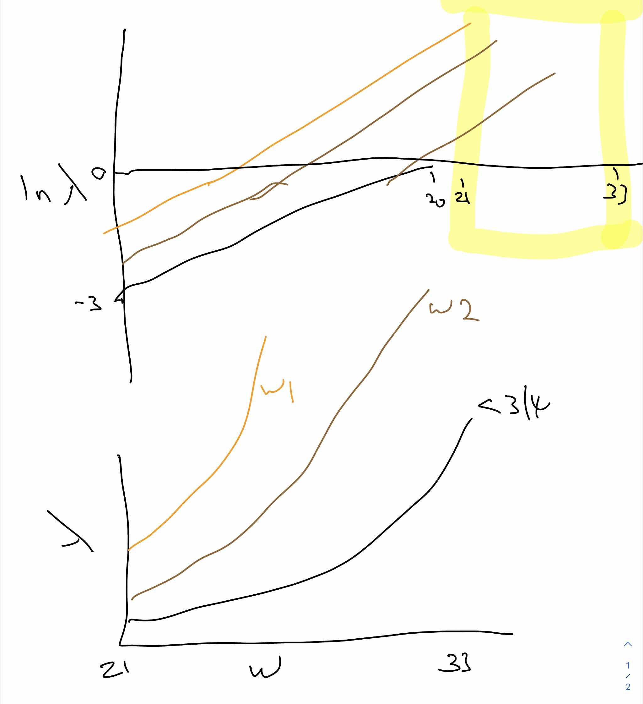

```{r setup, include=FALSE}
knitr::opts_chunk$set(echo = TRUE,tidy=TRUE,message=FALSE,warning=FALSE,results="hold")
showsol<-TRUE
```

**Hints and reminders are in bold**
 
<span class="question">Questions appear in blue.</span>

<details><summary>Some hints and answers are hidden away in a fold like this</summary>
Well done, you found me!
</details>

The exam style questions are optional, but will be helpful for, well, the exam. They will also help you now to see if you understand the content.

# <a id="interactivew1">Interactive session - first week</a>

## Problem 1: Exam 2005 (Problem 1d-f - slightly modified) - Female crabs and satellites

(Only a subset of 20 crabs in the original data was used in the exam
problems, but we will use the full data set of 173 crabs - so results
will not be the same. Permitted aids for the exam was "all printed and
handwritten material and all calculators" - NB that is not the case for 2018!)

We assume that the number of satellites for each female crab follows a
Poisson distribution and want to perform a Poisson regression using a
log-link to find if there is a connection between the expected number of
satellites `Sa` and the width `W` and colour `C` of the carapace of the
female crab.

* `C`: the color of the female crab (1=light medium, 2=medium, 3=dark medium, 4=dark)
* `W`: width of carapace (cm)

The following model was fitted.

```{r,tidy=FALSE}
crab <- read.table("https://www.math.ntnu.no/emner/TMA4315/2018h/crab.txt")
colnames(crab) <- c("Obs", "C", "S", "W", "Wt", "Sa")
crab <- crab[,-1] #remove column with Obs
crab$C <- as.factor(crab$C)
modelEXAM <- glm(Sa ~ W + C, family = poisson(link = log), data = crab, contrasts = list(C = "contr.sum"))
summary(modelEXAM)
library(car)
Anova(modelEXAM, type = "III", test.statistic = "Wald")
```

<span class="question">a) Write down the estimated model and evaluate the significance of
the estimated coefficients.</span> 

<details><summary>Answer</summary>
The estimated model is

$$
\begin{aligned}
Y_i &\sim \text{Poisson}(\lambda_i) \\
\log{\lambda_i} &= -2.92 + 0.15 \text{W} + 0.27 X_1 + 0.07 X_2 - 0.17 X_3 + \xi X_4
\end{aligned}
$$

where $W$ is the width, and $X_j$ is an indicator of whether the female is in colour category $j$. $\xi$ is the effect of $X_4$, to be calculated later. Note that we use a sum to zero contrast.

The `summary()` gives Wald statistics and their associated p-values. The effects of width (`W`) is significant: p<<0. For the colour effects, C2 is clearly not significantly different from C4: C1 and C3 are both just either side of the critical value at 5%. It is notlcealr why the contrast to C4 is important, though.

</details>


<span class="question">How would you proceed to evaluate the significance of the coefficient for the colour C4. Explain (but only do the calculation if you really feel like it).</span>

<details><summary>Hint</summary>
First, work out what the coefficient is. Then explain what test you would use, and where you would get the components of it.

If you want to do the calculation, you will need to do a bit of matrix manipulation in R. 
</details>

<details><summary>Answer</summary>
The coefficient is $-\sum_{i=1}^3{\beta_i} = -(0.27 + 0.07 - 0.17) = -0.17$

We can calculate the standard error using the contrast, $C$ and can plug this into 

$$
H_0: {\bf C}{\bf \beta}={\bf d} \text{ vs. } H_1: {\bf C}{\bf \beta}\neq {\bf d}
$$

i.e. $C=\{0,0-1,-1,-1 \}$ (the 0s are for the intercept and `W` term), and $\beta = \{-2.92, 0.15, 0.27, 0.07, -0.17\}$ so we test if $-(0.27 + 0.07 - 0.17) = -0.17$ is different from 0. We can use the Wald statistic:

$$
w=({\bf C} \hat{\boldsymbol{\beta}}-{\bf d})^{\text T}[{\bf C}F^{-1}(\hat{\beta}){\bf C}^{\text T}]^{-1}({\bf C}\hat{{\boldsymbol \beta}}-{\bf d})
$$

where $F^{-1}(\hat{\beta})$ is the covariance matrix, which we can extract with `vcov()`:

```{r}
vcov(modelEXAM)
```


```{r}
C = t(as.vector(c(0,0,-1,-1,-1)))
betahat <- coef(modelEXAM)
d <- 0
invF <- vcov(modelEXAM)

# solve() calculates the inverse of the matrix
(w <- t(C%*%betahat-d)%*%solve(C%*%invF%*%t(C))%*%(C%*%betahat-d))

```

(the calculation of `w` involves a bit of over-kill and matrix operations)

We are testing one hypothesis , so $r=1$, so we compare this to a $\chi^1_1$ distribution:

```{r}
pchisq(w, 1, lower.tail = FALSE)
```

So this is not significant at 5%.
</details>

<span class="question">Perform a test to evaluate the fit of the model. What is your conclusion?<span class="question">
Use a 5% significance level for your evaluations. 

<details><summary>Hint</summary>
We are asking if any variation not explained by the model could just be random Poisson noise.

</details>

<details><summary>Answer</summary>
We want to test if the residual deviance follows a $\chi^2$ distribution. Luckily `summary()` gives us what we need:

```{r}
summary(modelEXAM)
```

The residual deviance is `r modelEXAM$deviance`, with `r modelEXAM$df.residual` degrees of freedom. The p-value is thus:

```{r}
pchisq(modelEXAM$deviance, modelEXAM$df.residual, lower=FALSE)
```

which is horribly significant.

</details>

(In Problem 3d we derive the mathematical formula for the test statistic this test is based on.)


<span class="question">b) Make a sketch *by hand* illustrating the connection between the expected
number of satellites and the width of the carapace for each of the four
colours of the crab. </span>

<details><summary>Answer</summary>

These are the coefficients:
```{r}
coef(modelEXAM)
```

Start by drawing on the log scale, so we get straight lines. The C4 effect is about -0.17, so C3 and C4 cross the x axis at about -3.1, and the y-axis at about 3.1/0.15=~20. C2 crosses the x axis at about -2.85, and C1 at -2.65.

But in the data W ranges between about 21 and 33, so the values of $\log{\lambda}$ are all positive: for C3 $\log{\lambda}$ is between about $-3.1+21\times 0.15 = 0.05$ and $-3.1+33\times 0.15 = 1.85$.

On the log scale these are all parallel. But on the data sale, they will diverge. So we end up with something like this mess:



</details>

The estimated multiplicative change in the
expected number of satellites when the width of the carapace is changed
by 1 cm is, according to the model, independent of the colour. 

<span class="question">Explain why.</span>

<details><summary>Answer</summary>
Because the model does not include any interaction between W and C.
</details>

<span class="question">Also find a 95% confidence interval for this change.</span>

<details><summary>Answer</summary>
```{r}
exp(confint(modelEXAM)["W",])
```
</details>

c) Let $\hat{\eta}(x_{W})$ be the estimated linear predictor when the width of the carapace is $x_{W}$ and the crab is "light medium". 

<span class="question">What is the distribution of $\hat{\eta}(x_{W})$? </span>
<details><summary>Answer</summary>
It is a linear combination of normal random variables (the estiamtes of the parameters), so must be Normal.

</details>

<span class="question">Which value of $x_W$ would give estimated mean number of satellites equal to 5?</span>

<details><summary>Answer</summary>
We need to plug in the slope for the `W` effect, and the "light medium" (=C1) effect:

$$
\ln(5) = -2.92 + 0.15\times W_5 + 0.27 = -2.65 + 0.15\times W_5
$$

i.e. 

$$
W_5 = \frac{\ln(5)  + 2.65}{0.15} = 28.4
$$

Or, in R: 

```{r}
(W5 = (log(5) -(coef(modelEXAM)["(Intercept)"] + coef(modelEXAM)["C1"]))/coef(modelEXAM)["W"])
```

The slight difference is due to rounding.
</details>

<span class="question">Optional: Using R -- for this value of $x_W$, construct a 95% confidence interval for the mean number of satellites.</span>
<details><summary>Hint</summary>
use the `predict` function: `?predict.glm` tells you more.
</details>

<details><summary>Answer</summary>
We do this be predicting the value.
```{r}
newd <- data.frame(C=factor(1, levels=levels(crab$C)), W=W5)
(pred <- predict(modelEXAM, newdata = newd, type="link", se.fit = TRUE))

# 95% CI:

(c(pred$fit + 1.96*pred$se.fit, pred$fit - 1.96*pred$se.fit))
```
</details>

<span class="question">Optional: Use `ggplot` to create (and improve) the sketch from b).</span>

<details><summary>Answer/Hint (not yet added)</summary>
42
</details>

---

## Problem 2: Exam 2017 (Problem 1) - Poisson regression

Consider a random variable $Y$. In our course we have considered the univariate exponential family having distribution (probability density function for continuous variables and probability mass function for discrete variables)
$$ f(y)=\exp \left( \frac{y \theta-b(\theta)}{\phi}w + c(y,\phi,w) \right)$$
where $\theta$ is called the _natural parameter_ (or parameter of interest) and $\phi$ the _dispersion parameter_. 

The Poisson distribution is a discrete distribution with probability mass function
$$ f(y)=\frac{\lambda^{y}}{y!}\exp(- \lambda), \text{ for } y=0,1,\ldots$$
where $\lambda>0$.

**a)** (10 points)

* <span class="question">Show that the Poisson distribution is a univariate exponential family, and specify what the elements of the exponential family ($\theta$, $\phi$, $b(\theta)$, $w$, $c(y,\phi,w)$) are.</span>

<details><summary>Answer/Hint (not yet added)</summary>
42
</details>

* <span class="question">What is the connections between $\text{E}(Y)$ and elements of the exponential family? </span>

<details><summary>Answer/Hint (not yet added)</summary>
42
</details>

* <span class="question">What is the connections between $\text{Var}(Y)$ and elements of the exponential family?</span>

<details><summary>Answer/Hint (not yet added)</summary>
42
</details>

* <span class="question">Use these connections to derive the mean and variance for the Poisson distribution.</span>

<details><summary>Answer/Hint (not yet added)</summary>
42
</details>

* <span class="question">If the Poisson distribution is used as the distribution for the response in a generalized linear model, what is the _canonical link_ function?</span>

<details><summary>Answer/Hint (not yet added)</summary>
42
</details>


**b)** (15 points)

We consider a Poisson regression with log link $\eta_i=g(\mu_i)=\ln(\mu_i)$, and linear predictor equal to $\eta_i={\bf x}_i^T \boldsymbol{\beta}$. Further, let $p$ be the number of regression parameters in $\boldsymbol{\beta}$ (intercept included). The response--covariate pairs $(Y_i, {\bf x}_i)$ are independent for $i=1,\ldots, n$.

* <span class="question">Does this set-up satisfy the _requirements_ of a GLM model? Explain.</span>

<details><summary>Answer/Hint (not yet added)</summary>
42
</details>

* <span class="question">Write down the log-likelihood.</span>

<details><summary>Answer/Hint (not yet added)</summary>
42
</details>

* <span class="question">From the log-likelihood, _derive_ the formula for the score function ${\bf s}(\boldsymbol{\beta})$ and the expected Fisher information matrix, ${\bf F}(\boldsymbol{\beta})$.</span>
* <span class="question">What are the dimensions of ${\bf s}(\boldsymbol{\beta})$ and ${\bf F}(\boldsymbol{\beta})$?</span>

<details><summary>Answer/Hint (not yet added)</summary>
42
</details>

* <span class="question">How can ${\bf s}(\boldsymbol{\beta})$ and ${\bf F}(\boldsymbol{\beta})$ be used to arrive at a maximum likelihood estimate for $\boldsymbol{\beta}$?</span>

<details><summary>Answer/Hint (not yet added)</summary>
42
</details>

**c)** (10 points)

We now look at a data set giving the number of species of tortoise on the various Galapagos Islands (Data taken from the book "Practical Regression and Anova using R" by Julian J. Faraway.).

The data set contains measurements on 30 islands, and we study the following variables:

* `Species`: The number of species of tortoise found on the island.
* `Area`: The area of the island (km$^2$).
* `Elevation`: The highest elevation of the island (m).
* `Nearest`: The distance from the nearest island (km).
* `Scruz`: The distance from Santa Cruz island (km).
* `Adjacent`: The area of the adjacent island (km$^2$).


We have fitted a Poisson regression with log link to `Species` as response, and the other five variables are used as continuous covariates. Print-out from the fitted model is given in below.

```{r}
library(faraway)
fit <- glm(Species~Area+Elevation+Nearest+Scruz+Adjacent,data=gala,family=poisson(link=log))
summary(fit)
```

Let $\boldsymbol{\beta}$ be a $6 \times 1$ column vector with the regression coefficients (intercept included), and let $\hat{\boldsymbol{\beta}}$ be the maximum likelihood estimator for $\boldsymbol{\beta}$. 

* <span class="question">Write down the asymptotic distribution for $\hat{\boldsymbol{\beta}}$, and specify how the covariance matrix for $\hat{\boldsymbol{\beta}}$ is estimated.</span>

<details><summary>Answer/Hint (not yet added)</summary>
42
</details>

We will focus on the effect of `Elevation`, and denote the corresponding regression coefficient $\beta_2$. 

* <span class="question">Write down the maximum likelihood estimate for $\beta_2$ in the print-out above.</span>

<details><summary>Answer/Hint (not yet added)</summary>
42
</details>

* <span class="question">How can you explain this value to a biologist interested in understanding the effect of `Elevation` on the number of species of tortoise found on the islands? </span>

<details><summary>Answer/Hint (not yet added)</summary>
42
</details>

* <span class="question">What is numerical value for the estimated standard deviation of $\hat{\beta}_2$ given in above?</span>

<details><summary>Answer/Hint (not yet added)</summary>
42
</details>

* <span class="question">Construct an approximate 95\% confidence interval for $\beta_2$.</span>

<details><summary>Answer/Hint (not yet added)</summary>
42
</details>

## Problem 3: Exam December 2017 from UiO, Problem 1.
(written out - with small changes to fit the notation we use - from <https://www.uio.no/studier/emner/matnat/math/STK3100/h17/stk3100-4100_2017_2eng.pdf>)

Assume that the random variable $Y$ is Poisson distributed with probability mass function (pmf)

$$\text{P}(Y = y | \lambda)= \frac{\lambda^y}{y!} \exp(-\lambda), \ y = 0, 1, 2, \dots.$$

<span class="question">a) Show that the distribution of $Y$ is an exponential family, that is, show that the pmf can be written in the form
$$\exp\left\{\frac{y \theta - b(\theta)}{\phi}w + c(y, \phi, w)\right\},$$
and determine $\theta$, $\phi$, $w$, $b(\theta)$ and $c(y, \phi, w)$.</span>

<details><summary>Answer/Hint (not yet added)</summary>
42
</details>

We then assume that $Y_1, Y_2, \dots, Y_n$ are independent with the pmf from a), and let $\mu_i = \text{E}(Y_i)$, $i = 1, \dots, n$.

<span class="question">b) Explain what we mean by a generalized linear model (GLM) for $Y_1, Y_2, \dots, Y_n$ with link function $g(\cdot)$, and determine the canonical link function.</span>

<details><summary>Answer/Hint (not yet added)</summary>
42
</details>

<span class="question">c) Derive an expression for the log-likelihood function $l(\mathbf{\mu}; \mathbf{y})$, where $\mathbf{y} = (y_1, \dots, y_n)^T$ is the observed value of $\mathbf{Y} = (Y_1, Y_2, \dots, Y_n)^T$ and $\mathbf{\mu} = (\mu_1, \dots, \mu_n)^T$.</span>

<details><summary>Answer/Hint (not yet added)</summary>
42
</details>

<span class="question">d) Explain what we mean by a saturated model and determine the maximum of $l(\mathbf{\mu}; \mathbf{y})$ for the saturated model.</span>

<details><summary>Answer/Hint (not yet added)</summary>
42
</details>

<span class="question">e) Explain what we mean by the deviance $D(\mathbf{y}; \mathbf{\hat{\mu}})$ of a Poisson GLM, find an expression for the deviance, and discuss how it may be used.</span>

<details><summary>Answer/Hint (not yet added)</summary>
42
</details>


# R packages

```{r, eval=FALSE}
install.packages(c("tidyverse", 
  "ggplot2", 
  "statmod",
  "corrplot", 
  "ggplot2", 
  "GGally",
  "boot"))
```

# Further reading
* A. Agresti (1996): "An Introduction to Categorical Data Analysis".
* A. Agresti (2015): "Foundations of Linear and Generalized Linear Models." Wiley.
* A. J. Dobson and A. G. Barnett (2008): "An Introduction to Generalized Linear Models", Third edition. 
* J. Faraway (2015): "Extending the Linear Model with R", Second Edition. <http://www.maths.bath.ac.uk/~jjf23/ELM/>
* P. McCullagh and J. A. Nelder (1989): "Generalized Linear Models". Second edition.

